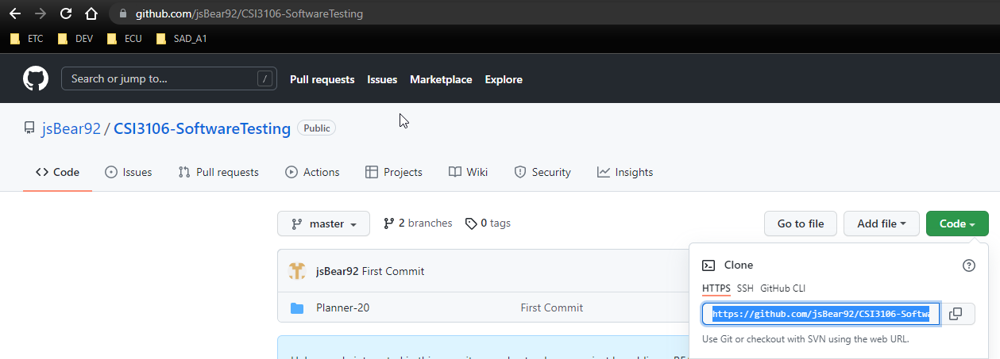
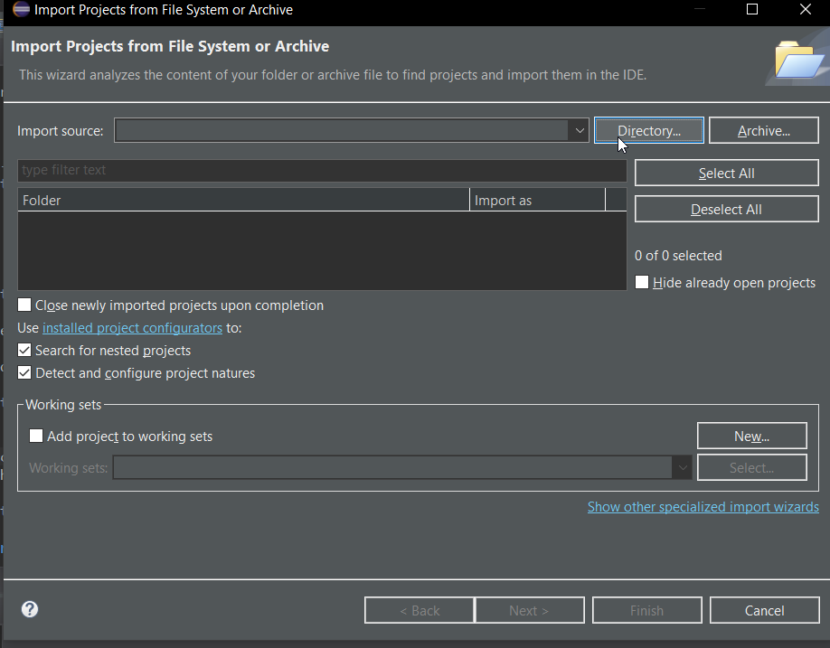
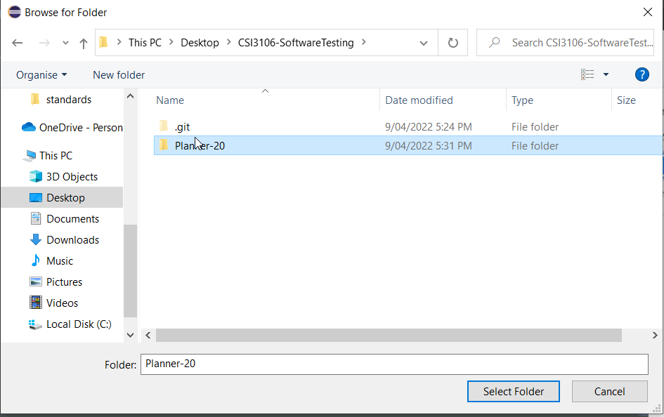
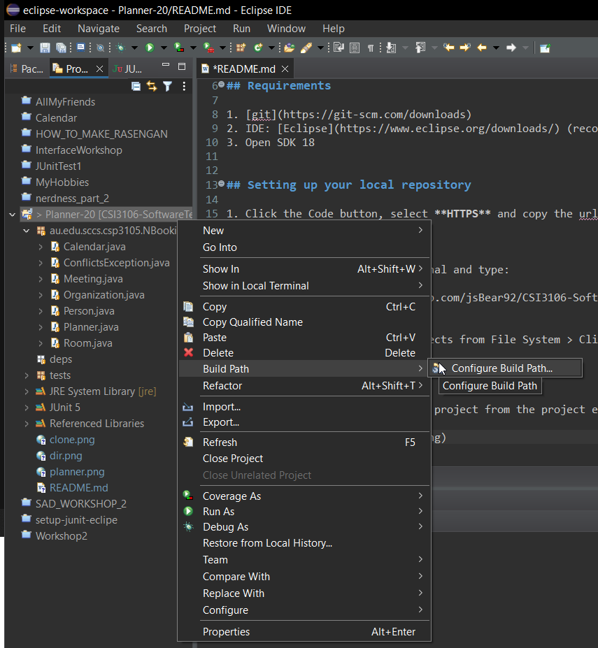
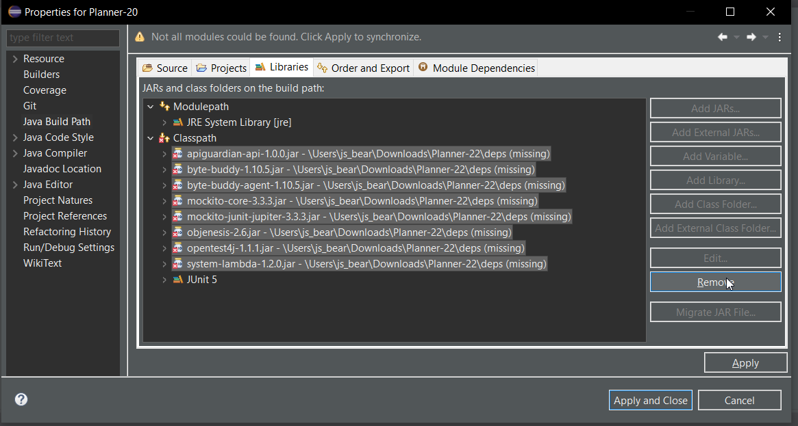
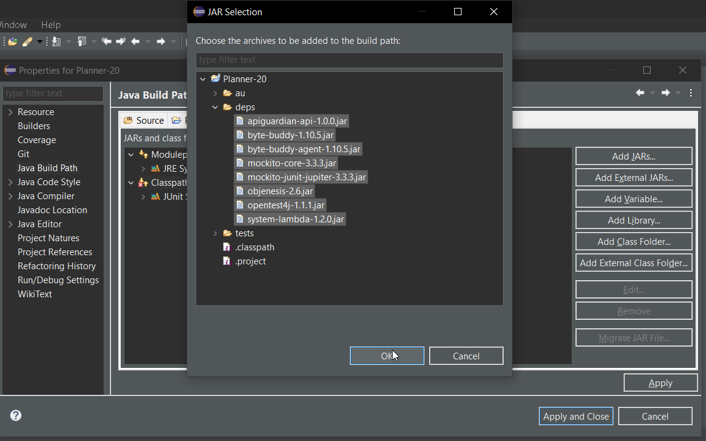
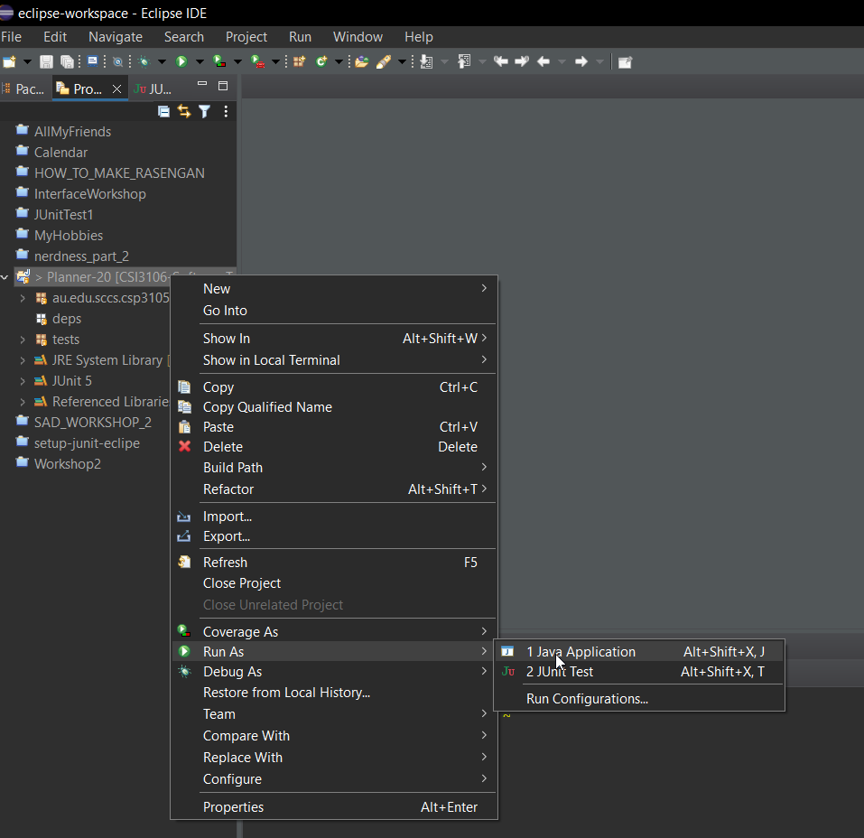
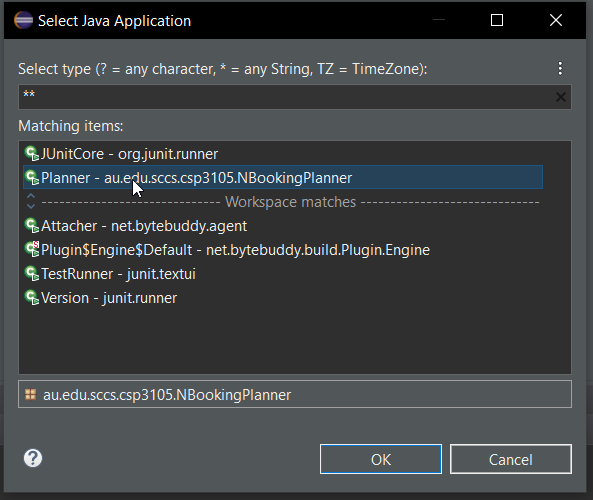
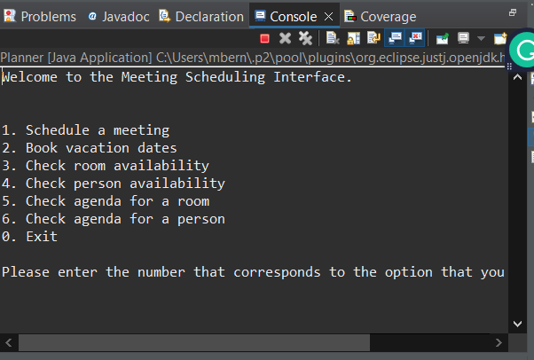
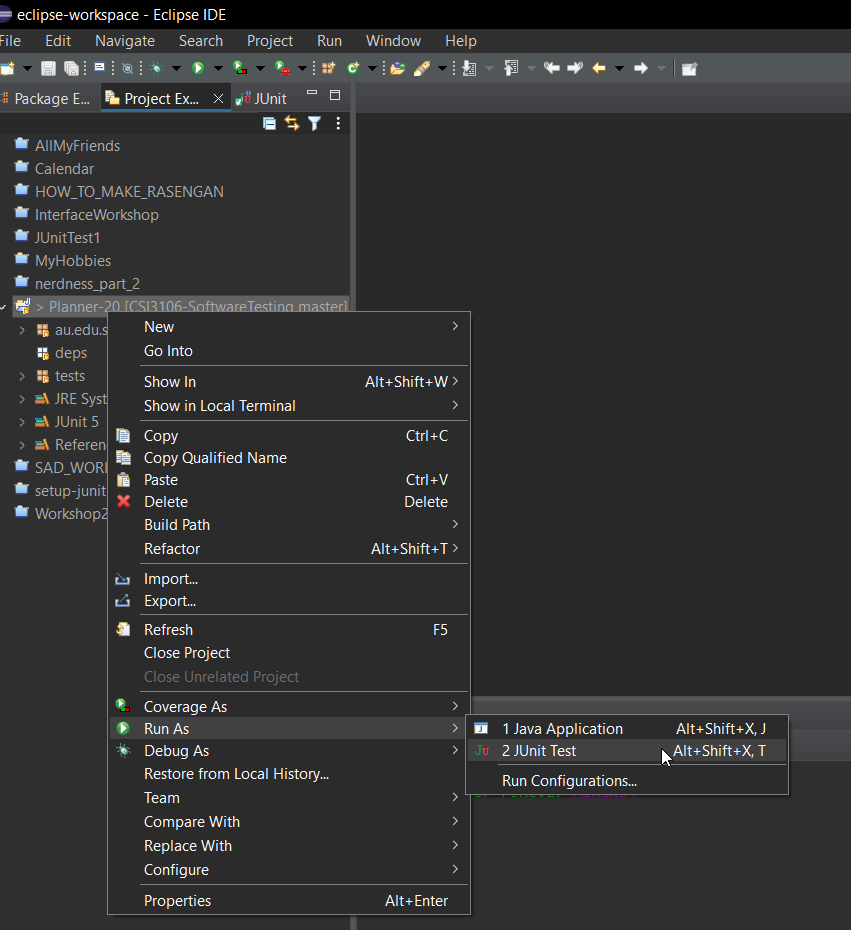

# Software Testing Case Study

## Description

Remote repository for event booking software component system.

## Requirements

1. [git](https://git-scm.com/downloads)
2. IDE: [Eclipse](https://www.eclipse.org/downloads/) (recommended)
3. Open SDK 18

## Setting up your local repository using Eclipse IDE

1. Click the Code button, select **HTTPS** and copy the url.

2. Go to your command line terminal and type:

   <code>git clone https://github.com/jsBear92/CSI3106-SoftwareTesting.git</code>

3. Open your Eclipse IDE
4. Go to File > Select Open Projects from File System > Click the Directory button > Select the folder where you download our repository

5. Right click on the Planner-20 project from the project explorer right pane.

6. Select all existing JAR files under Classpath and click Remove.

7. Click Add JARs... and select your local JAR files from your local repository then click Apply and Close button.

8. Right click on the Planner-20 project > Select Run As > Select Java Application to run the console app

then select the Planner class then click OK.

Check if everything is working

9. To run test cases using JUnit, right click on the Planner-20 project > Select Run as > Select JUnit Test.

## Branching

Please create your own branch when creating your test cases by branching off of from the master branch with the naming convention /your-name/test/feature.

<code>git checkout -b "mike/test/schedule-meeting"</code>

## System functionalities

1. Schedule a meeting (Mike)
2. Booking vacation dates
3. Checking availability for a room (Neb)
4. Checking availability for a person (Mat)
5. Check the agenda for a room (James)
6. Check the agenda for a person

## Classes

1. Planner (Main)
2. Meeting
3. Calender
4. ConflictsException
5. Room
6. Person
7. Organisation
