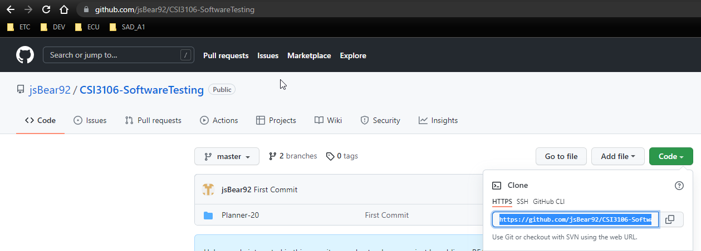
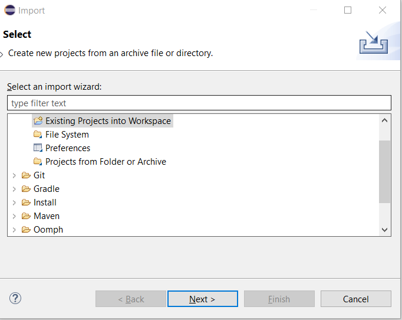
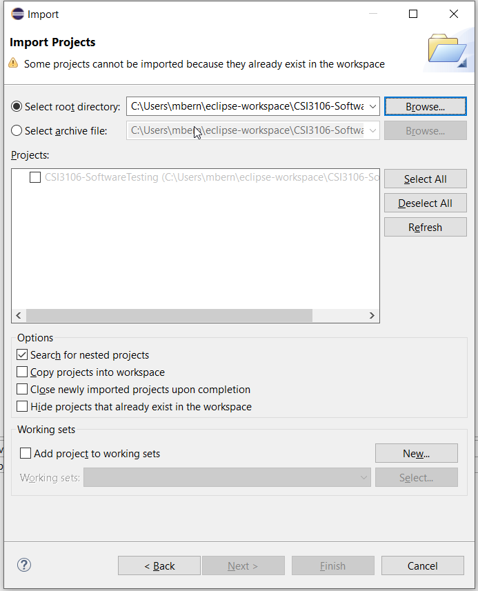
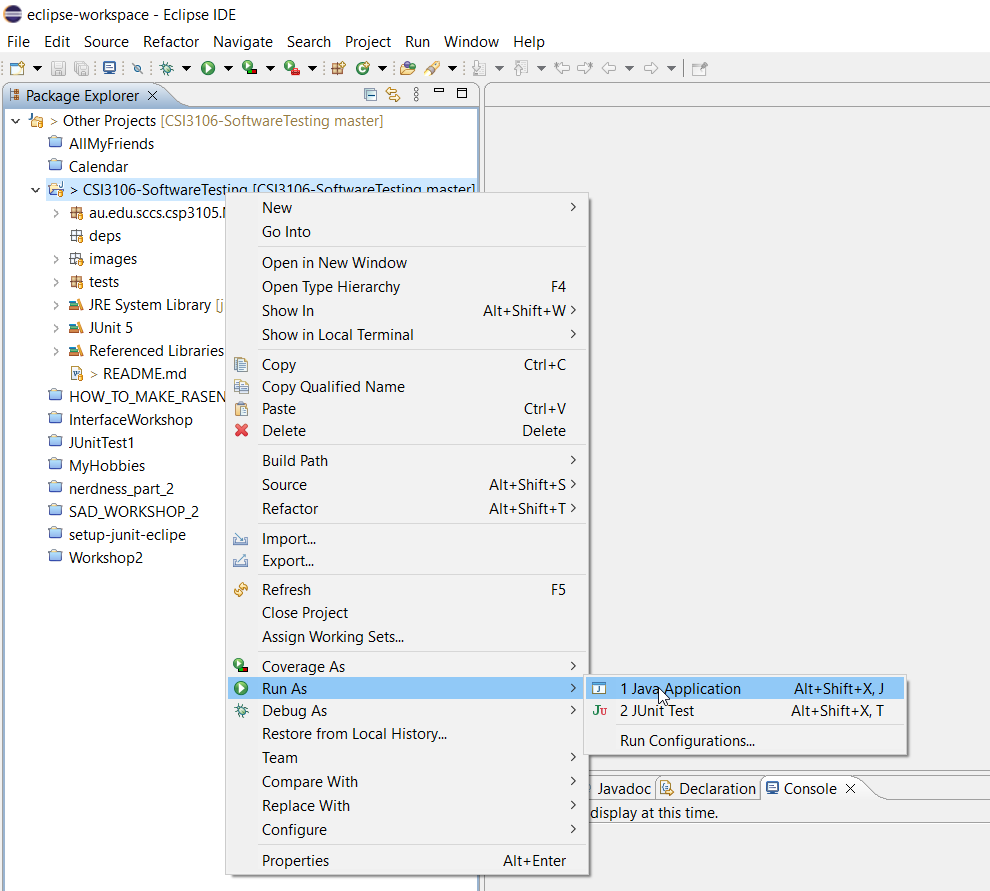
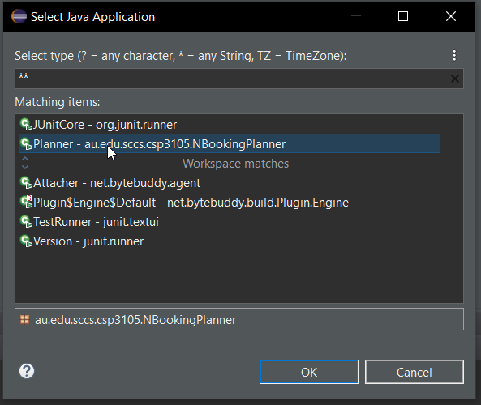
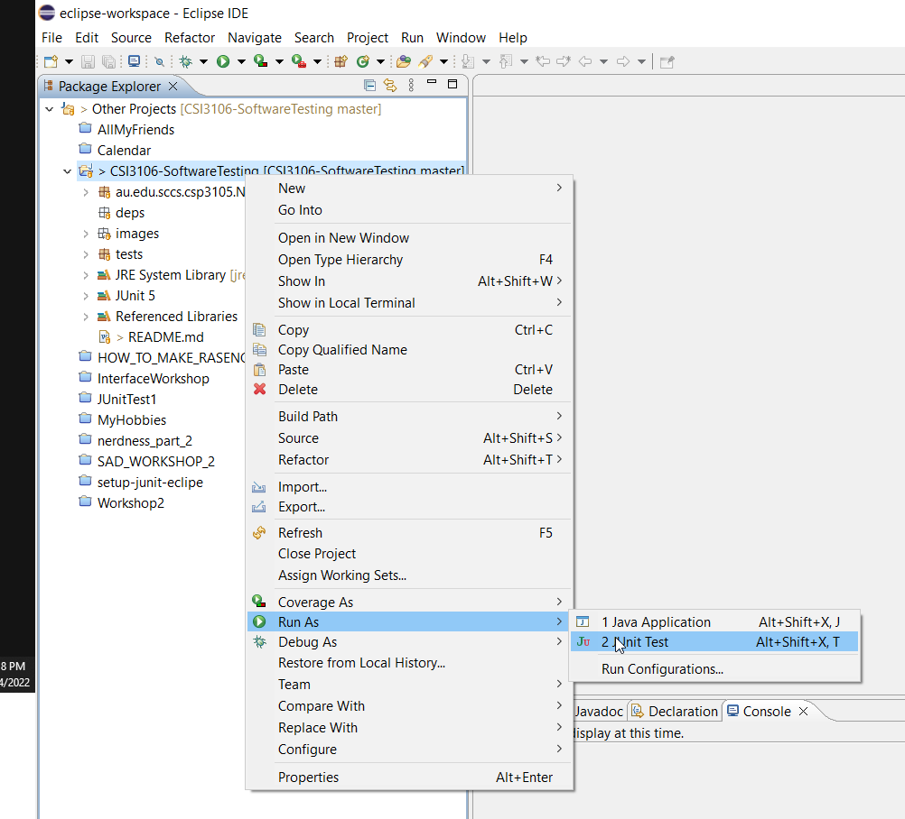
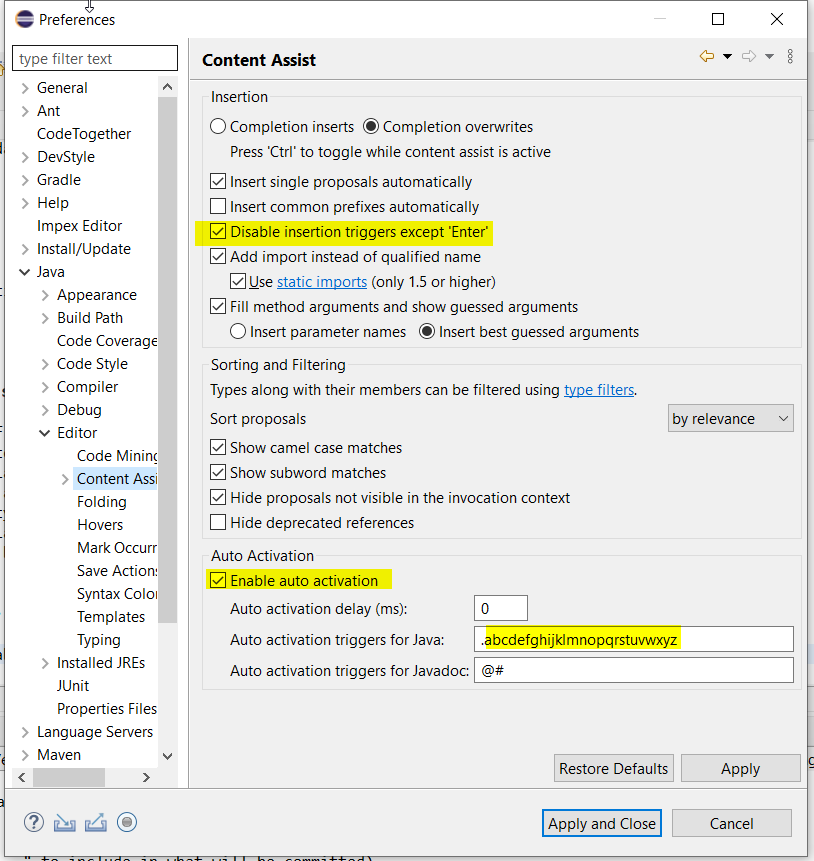

# Software Testing Case Study

## Description

Remote repository for event booking software component system.

## Requirements

1. [git](https://git-scm.com/downloads)
2. IDE: [Eclipse](https://www.eclipse.org/downloads/) (recommended)
3. Open SDK 18

## Setting up your local repository using Eclipse IDE

1. Click the Code button, select **HTTPS** and copy the url.

2. Go to your command line terminal and type:

   <code>git clone https://github.com/jsBear92/CSI3106-SoftwareTesting.git</code>

3. Open your Eclipse IDE, go to File > Import > Existing Projects into Workspace > Select root directory > Browse > and select CSI3106-SoftwareTesting.
   

4. Check Search for nested projects and click the Finish button.
   
5. To run the console app: right click CSI3106-SoftwareTesting project > Run as > Select 1 Java Application, and select Planner if prompted.
   
   
6. To run your test cases: right click CSI3106-SoftwareTesting project > Run as > Select 2 JUnit Test.
   

## Branching

Please create your own branch when creating your test cases by branching off of from the master branch with the naming convention /your-name/test/feature.

<code>git checkout -b "mike/test/schedule-meeting"</code>

## System functionalities

1. Schedule a meeting (Mike)
2. Booking vacation dates
3. Checking availability for a room (Neb)
4. Checking availability for a person (Mat)
5. Check the agenda for a room (James)
6. Check the agenda for a person

## Classes

1. Planner (Main)
2. Meeting
3. Calender
4. ConflictsException
5. Room
6. Person
7. Organisation

## Identified issues

1. In the event of a leap year, Feb 29 is valid but unable to book any event on that day.
2. Issues associated with booking an event between 11.00pm – 11.59pm
3. Bookings associated with 30th November
4. Input checking and Ambiguous error messages
5. Case sensitivity associated with inputs
6. Bookings associated with certain days of the month
7. A vacation can be booked with a start date of the 32nd day of a month  

## How to enable Eclipse autocomplete

1. Go to Window Tab > Preferences > Java > Editor > Select Content Assist and follow the configuration on the following screenshot.

